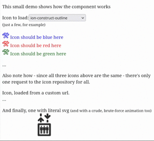

# vue-cached-icon

Caching icon loader with an emphasis for loading the icons directly from the CDN.

Also supports svg string literals or urls as source.



## Demo

https://www.velis.si/vue-cached-icon/

## Features

* Renders sanitised SVG
* Loads from CDN, any local URL, any full URL or SVG literal
  * 'ion-*': loads from ionicons repository
  * 'mdi-*': loads from material design icons repository
  * 'fa-*': loads from font-awesome repository
* Register your own repositories using `registerIconProvider(prefix: string, urlBuilder: (name: string) => string)`
* Caches loaded icons, there will be only one HTTP request per icon as long as the app is running
* Applies currentColor to icons: if colour is not otherwise specified, icons will have same color as HTML text
* Sizes icons to the surrounding text by default, see [Sizing and styling](#sizing-and-styling)

## Installing

```bash
npm install --save vue-cached-icon
```

## Using

```html
<template>
  <div>
    <!-- will load by name from Ionicons CDN -->
    <cached-icon name="ion-warning"/>

    <!-- will load from your own server or any other if full URL is provided -->
    <cached-icon name="/images/my-custom-icon.svg"/>

    <!-- will display the provided SVG, but with all processing (sanitizing, applying currentColor) -->
    <cached-icon :name="<svg...mySvgLiteral</svg>"/>
  </div>
</template>
```

```javascript
<script setup>
  import { CachedIcon } from 'vue-cached-icon';
</script>
```

## Sizing and styling

Icon sets ship their SVGs with a `viewBox` but no `width` / `height`, so the size has to come from the use site.
This package provides it for you: the icon renders in an inline `<span class="cached-icon-wrapper">` sized at `1em`,
so an icon is as big as the text around it and moves with the font size.

Everything is a plain default that your own CSS overrides — the package stylesheet is prepended to `<head>`, so your
rules win without `!important`:

```css
/* a fixed size */
.cached-icon-wrapper { width: 24px; height: 24px; }

/* or size a group of icons through the font */
.toolbar .cached-icon-wrapper { font-size: 1.5rem; }
```

SVGs that declare their own `width` / `height` keep them.

## Contributing

Contributions are welcome! Feel free to open an issue or submit a pull request.

Please make sure your changes are well-tested and follow the existing code style.

## Credits

* [Vue](https://vuejs.org) The Progressive JavaScript Framework
* [Ionicons](https://github.com/ionic-team/ionicons) project
* [DOMPurify](https://github.com/cure53/DOMPurify) project