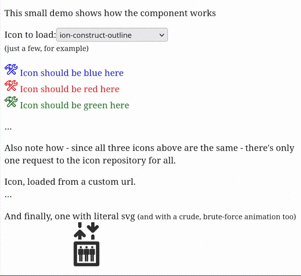

# vue-cached-icon

Caching icon loader with an emphasis for loading the icons directly from the CDN.

Also supports svg string literals, urls to raster images (png, jpg, gif, webp, bmp, ico, avif) or urls to svg as
source.



## Demo

https://www.velis.si/vue-cached-icon/

## Features

* Renders sanitised SVG
* Also renders raster images (png, jpg, jpeg, gif, webp, bmp, ico, avif), recognised by their URL's extension and
  handed straight to the browser, unsanitised, since there's no markup for DOMPurify to sanitise
* Rejects a URL that resolves to neither a raster image nor a valid SVG, instead of rendering it half-sanitised
* Loads from CDN, any local URL, any full URL or SVG literal
  * 'ion-*': loads from ionicons repository
  * 'mdi-*': loads from material design icons repository
  * 'fa-*': loads from font-awesome repository
* Register your own repositories using `registerIconProvider(prefix: string, urlBuilder: (name: string) => string)`
* Caches loaded icons, there will be only one HTTP request per icon as long as the app is running
* Retries icons that fail to load for a reason that may pass, see [Failed loads](#failed-loads)
* Applies currentColor to icons: if colour is not otherwise specified, icons will have same color as HTML text
* Sizes icons to the surrounding text by default, see [Sizing and styling](#sizing-and-styling)
* Safe for server-side rendering: icons load in the browser after mount, see [Server-side rendering](#server-side-rendering)

## Installing

```bash
npm install --save vue-cached-icon
```

## Using

```html
<template>
  <div>
    <!-- will load by name from Ionicons CDN -->
    <cached-icon name="ion-warning"/>

    <!-- will load from your own server or any other if full URL is provided -->
    <cached-icon name="/images/my-custom-icon.svg"/>

    <!-- raster images are recognised by extension and rendered directly as an , unsanitised -->
    <cached-icon name="/images/my-custom-icon.png"/>

    <!-- will display the provided SVG, but with all processing (sanitizing, applying currentColor) -->
    <cached-icon :name="mySvgLiteral"/>
  </div>
</template>
```

```vue
<script setup>
  import { CachedIcon } from 'vue-cached-icon';
</script>
```

The component emits `icon-loaded` with the icon name once the icon has rendered.

Besides `CachedIcon`, `registerIconProvider` and `retryFailedIcons` (see [Failed loads](#failed-loads)) the package
exports `resolveProviderUrl(name)`, which returns the URL a
name resolves to, `iconProviders`, the registry of providers by prefix, and `augment(svg)`, the sanitisation and
`currentColor` processing applied to every SVG.

## Failed loads

An icon that fails to load shows `…`, and the failure is logged to the console once per request. All icons with the
same name share the failure, and the next attempt is again a single request for all of them.

* A network error, HTTP 5xx, 401, 403, 408 and 429 are retried while the icon is displayed: after 2 s, then after a delay
  doubling up to 60 s, or after the delay the server asks for in `Retry-After`. When the browser comes back online,
  the retry happens right away. An icon mounted after the retry is due requests it right away as well.
* Any other HTTP status, such as 404, and a response that is not an SVG are not retried.

Call `retryFailedIcons()` when requests that failed may now succeed, e.g. after the user logs in. It forgets every
failed load, those not retried included, and the displayed icons load again right away:

```javascript
import { retryFailedIcons } from 'vue-cached-icon';

await login();
retryFailedIcons();
```

## Sizing and styling

Icon sets ship their SVGs with a `viewBox` but no `width` / `height`, so the size has to come from the use site.
This package provides it for you: the icon renders in an inline `<span class="cached-icon-wrapper">` sized at `1em`,
so an icon is as big as the text around it and moves with the font size.

Everything is a plain default that your own CSS overrides — the package stylesheet is prepended to `<head>`, so your
rules win without `!important`:

```css
/* a fixed size */
.cached-icon-wrapper { width: 24px; height: 24px; }

/* or size a group of icons through the font */
.toolbar .cached-icon-wrapper { font-size: 1.5rem; }
```

SVGs that declare their own `width` / `height` keep them. Raster images are sized the same way through the wrapper,
with `object-fit: contain` so their aspect ratio is preserved rather than stretched to fill it.

## Server-side rendering

During server-side rendering (Nuxt, VitePress, vite-ssg …) the component renders an empty
`<span class="cached-icon-wrapper">`: it neither fetches nor sanitises anything on the server. The icon loads once the
component is mounted in the browser, so the server-rendered markup always matches the first client render and
hydrates without mismatches. Icons are therefore not part of the static HTML.

## Contributing

Contributions are welcome! Feel free to open an issue or submit a pull request.

Please make sure your changes are well-tested and follow the existing code style.

## Credits

* [Vue](https://vuejs.org) The Progressive JavaScript Framework
* [Ionicons](https://github.com/ionic-team/ionicons) project
* [DOMPurify](https://github.com/cure53/DOMPurify) project